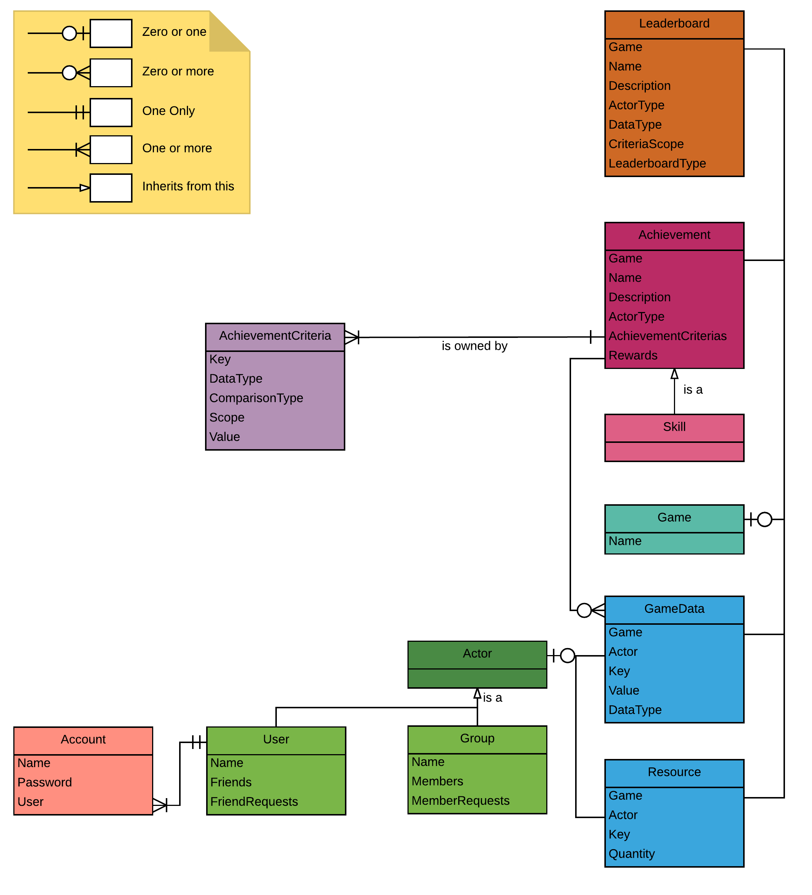

#Entity Model

A <xref:user> is the person playing the game. 

A <xref:group> is made up of a collection of Users.

Users and Groups both derive from the <xref:actor> type. 
This means that objects that reference an Actor can apply to either a User or a Group.

Actors can save <xref:gameData>.

GameData could be:
* A User's inventory
* A User's high score
* A Group's high score
* etc

or any other kind of data that you need to persist between play sessions.
 
[Resources](xref:resource) are items that can be traded or consumed. 
An Actor may collect 20 gems and decide to give 10 of them to another actor at a later point, resulting in both actors having 10 gems.

As with GameData, Resources can be obtained and given by both Users and Groups.

[Leaderboards](xref:leaderboard) are used to calculate an Actor's ranking against other actors of the same type.
One leaderboard may rank Groups by the amount of members they have, in a game where one goal is to make as big a group as possible.
Another leaderboard could be the typical high score, where Users are ranked by the score they have saved in the GameData.

[Achievements](xref:achievement) look at the GameData of a specfic Actor to see whether they have met the completion criteria for the achievement.
An achievement may check to see if an Actor's score is over 100, and if so, the Actor is evaluated as having completed the Achievement.

[Skills](<xref:skill) operate in the same way as Achievements but are conceptually different.
A Skill has the aim of teaching the player a "skill" in the process of completing it.
For example, a Skill may be to give 10 gems to 10 different people to complete the "sharing" Skill.

Achievements and Skills both have <xref:criteria> which is a set of conditions that need to be met in order for the Skill or Achievement to be considered as completed.
AchievementCriteria can look for specific data in GameData.

Once completed, an Achievement or Skill may offer rewards to the Actor. These rewards would be in the form of GameData. 
For example, an Actor may be credited with 20 points on completing an Achievement or Skill.
Those 20 points would be saved in that Actor's GameData.

Users can create, join and leave Groups.

Users can also befriend other Users.

Because there may be multiple [Games](xref:game), the Game is used to associate Achievements, Skills, Leaderboards, GameData and Resources whithin that specific game.

Each user has an <xref:account>.
The Account is only used to faciliatate user registration and logging in.
After the user has logged in, the Account is not used until the next time they log in.